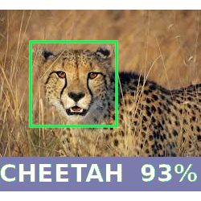

This module recognize the photos you upload.
============================================

This want to be the first step towards integrating a Deep Learning System into an ERP

With this example I would like to show the potential of integrating a deeplearnig system into an ERP.
Witg this example you can see how machine learning recognizes an input image.

The next steps I want to integrate are:

1) Possibility to give the machine new results for the photos. So basically, teach the machine.

2) Connect the learning machine result with basic actions in ERP. For example, if the machine recognizes a customer request then opens a new quotation request.

Screenshot:

